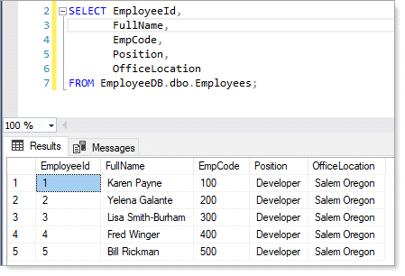


**Before running**

- SQL-Server needs to be installed
- Run from `Package Manager Console` **Update-Database** to create the database via `migrations`. 
  - See [reference](https://docs.microsoft.com/en-us/ef/core/cli/powershell).

 