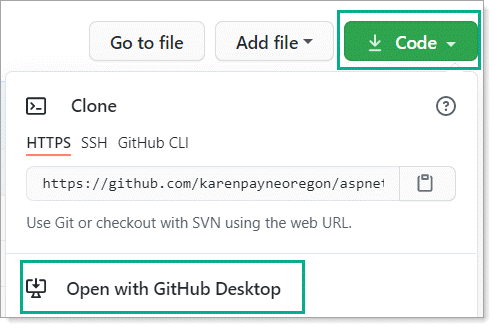

# To run the web application

Clone [this repository](https://github.com/karenpayneoregon/aspnetcode-1) using Git Desktop

Create the database (see section Create/populate database)

Open the solution in Visual Studio. Once loaded wait a few minutes as Visual Studio needs to peform several actions.

From Visual Studio `Build` menu, select `rebuild`.

Click on `IIS Express` button to run

---

## Issues

Let me know

---

#### Requires

:heavy_check_mark: `SSMS` (SQL-Server Management Studio)

:heavy_check_mark: Microsoft Visual Studio 2019

:heavy_check_mark: Git Desktop

---
## Create/populate database

1. Open `SSMS` (SQL-Server Management Studio)
1. Create a `new database` named `EmployeeDB`
1. From Object Explorer, select "Databases"
1. Right click on `Databases`, select `Refresh`
1. Create a new query using the `New Query` button
1. Copy the script in DataScript.sql (in the root folder)
1. Press <kbd>F5</kbd> to generate the able `Employees`
1. Select the `Tables` node from  Object Explorer and right click, select refesh
1. Right click on the table `Employees` -> Select top 1000 to verify records exists

