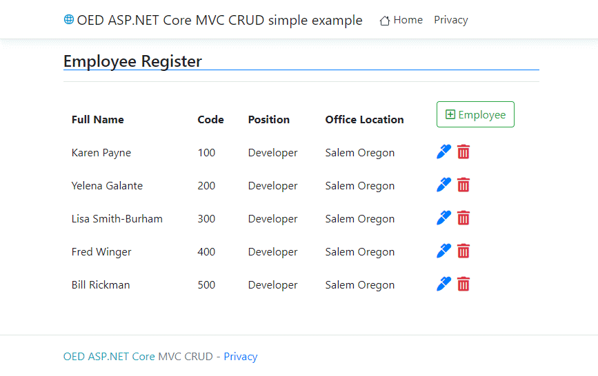
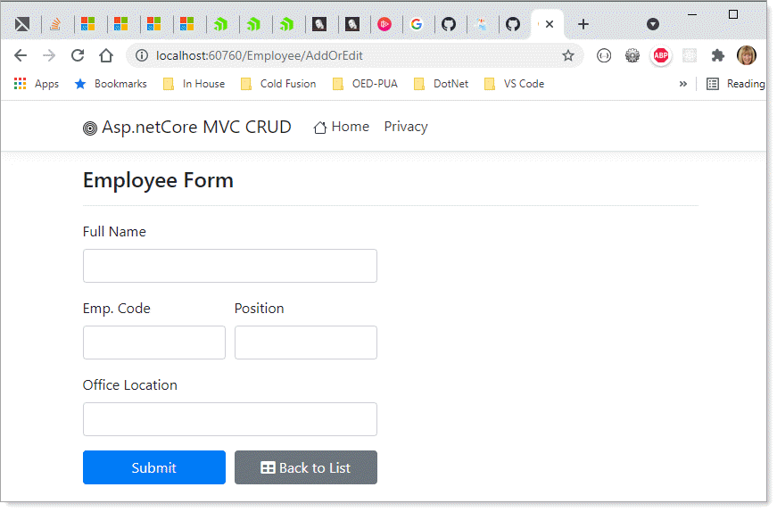
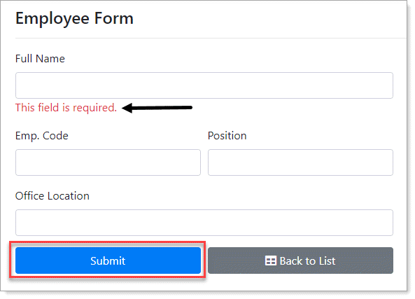
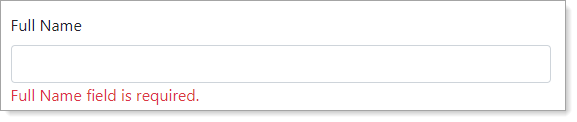
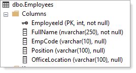

# About

Simple CRUD ASP.NET Core sample using SQL-Server as a database.

:yellow_circle: See instructions.md for steps to run



</br>



</br>



- In the following Employee class, validation is done on `full name` using [DataAnnotations](https://docs.microsoft.com/en-us/dotnet/api/system.componentmodel.dataannotations?view=net-5.0) 
- Captions are rendered using `DisplayName` attribute.
```csharp
public class Employee
{
    [Key]
    public int EmployeeId { get; set; }
    [Column(TypeName ="nvarchar(250)")]
    [Required(ErrorMessage ="This field is required.")]
    [DisplayName("Full Name")]
    public string FullName { get; set; }
    [Column(TypeName = "varchar(10)")]
    [DisplayName("Emp. Code")]
    public string EmpCode { get; set; }
    [Column(TypeName = "varchar(100)")]
    public string Position { get; set; }
    [Column(TypeName = "varchar(100)")]
    [DisplayName("Office Location")]
    public string OfficeLocation { get; set; }
}
```

###  Edit on the above, we can do better

Note on the property `FullName` that `ErrorMessage` has {0} which is replaced with the property name `FullName` which when there is a validation issue  we see `FullName`. 

It would be better to see Full Name. To do this we can override the Required Attribute a shown below the Employee class

```csharp
using System;
using System.Collections.Generic;
using System.ComponentModel;
using System.ComponentModel.DataAnnotations;
using System.ComponentModel.DataAnnotations.Schema;
using System.Linq;
using System.Threading.Tasks;

namespace Asp.netCoreMVCCRUD.Models
{
    public class Employee
    {
        [Key]
        public int EmployeeId { get; set; }
        [Column(TypeName ="nvarchar(250)")]
        [Required(ErrorMessage ="{0} field is required.")]
        [DisplayName("Full Name")]
        public string FullName { get; set; }
        [Column(TypeName = "varchar(10)")]
        [DisplayName("Code")]
        public string EmpCode { get; set; }
        [Column(TypeName = "varchar(100)")]
        public string Position { get; set; }
        [Column(TypeName = "varchar(100)")]
        [DisplayName("Office Location")]
        public string OfficeLocation { get; set; }
    }
}
```

Required Attribute override

```csharp
using System.ComponentModel;
using System.ComponentModel.DataAnnotations;

namespace Asp.netCoreMVCCRUD.Classes
{
    public class RequiredAttribute : System.ComponentModel.DataAnnotations.RequiredAttribute
    {
        private string displayName;

        public RequiredAttribute()
        {
            ErrorMessage = "{0} is required";
        }

        protected override ValidationResult IsValid(object value, ValidationContext validationContext)
        {
            var attributes = validationContext.ObjectType
                .GetProperty(validationContext.MemberName)
                .GetCustomAttributes(typeof(DisplayNameAttribute), true);
            
            displayName = attributes != null ? 
                (attributes[0] as DisplayNameAttribute).DisplayName : 
                validationContext.DisplayName;

            return base.IsValid(value, validationContext);
        }

        public override string FormatErrorMessage(string name)
        {
            return string.Format(ErrorMessageString, displayName.SplitCamelCase());
        }
    }
}
```

Note `SplitCamelCase` in `FormatErrorMessage`, this splits the property name so FullName in this case is shown as Full Name. We could go farther and lower case tokens after the first one.

```csharp
public static string SplitCamelCase(this string sender) => 
    Regex.Replace(Regex.Replace(sender, 
        "(\\P{Ll})(\\P{Ll}\\p{Ll})", "$1 $2"), 
        "(\\p{Ll})(\\P{Ll})", "$1 $2");
```

</br>




## SQL-Server 

Database table



## Data access

Entity Framework Core. Database needs to be created using migrations.
