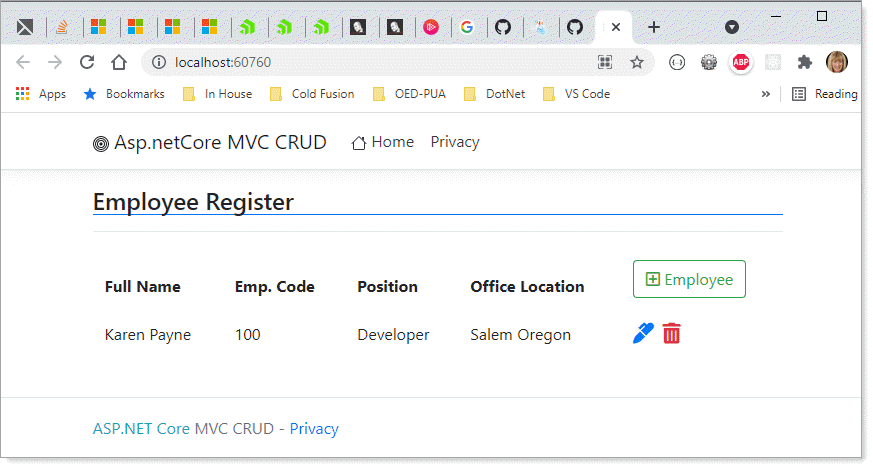

# About

Simple CRUD ASP.NET Core sample using SQL-Server as a database.



</br>


</br>


- In the following Employee class, validation is done on `full name` using [DataAnnotations](https://docs.microsoft.com/en-us/dotnet/api/system.componentmodel.dataannotations?view=net-5.0) 
- Captions are rendered using `DisplayName` attribute.
```csharp
public class Employee
{
    [Key]
    public int EmployeeId { get; set; }
    [Column(TypeName ="nvarchar(250)")]
    [Required(ErrorMessage ="This field is required.")]
    [DisplayName("Full Name")]
    public string FullName { get; set; }
    [Column(TypeName = "varchar(10)")]
    [DisplayName("Emp. Code")]
    public string EmpCode { get; set; }
    [Column(TypeName = "varchar(100)")]
    public string Position { get; set; }
    [Column(TypeName = "varchar(100)")]
    [DisplayName("Office Location")]
    public string OfficeLocation { get; set; }
}
```

Model for Employee

```csharp
public class ErrorViewModel
{
    public string RequestId { get; set; }

    public bool ShowRequestId => !string.IsNullOrEmpty(RequestId);
}
```

## SQL-Server 

Database table


## Data access

Entity Framework Core